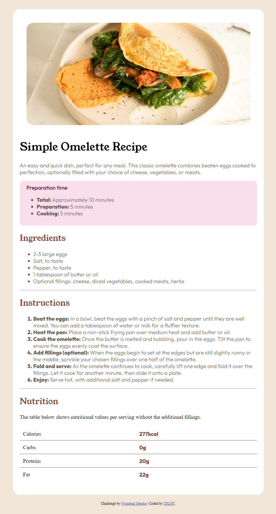

# Frontend Mentor - Recipe page solution

## Table of contents

 
  - [The challenge](#the-challenge)
  - [Screenshot](#screenshot)
  - [Links](#links)
- [My process](#my-process)
  - [Built with](#built-with)
  - [What I learned](#what-i-learned)
  
  - [Useful resources](#useful-resources)
- [Author](#author)
 

 
 

### Screenshot

 

### Links

- Solution URL: [Add solution URL here](https://your-solution-url.com)
- Live Site URL: [Add live site URL here](https://your-live-site-url.com)

## My process
this was a bit challenging to me because involved loads of alignments but i managed to finish it. It is close enough to the assigned.

### Built with

- Semantic HTML5 markup
- CSS custom properties
- Flexbox
- CSS Grid

 

### What I learned

 i have actually leanrt alot from this assignment because there was alot failures.i have learn flex-direction,grid,main and cross axis in flexbox ,how to use custome fonts (@font-face),before,::after ::makrker pseudo

 

### Useful resources

 Coding2Go on Youtube

## Author

 
- Frontend Mentor -(https://www.frontendmentor.io/profile/DILHT)
 

 
 